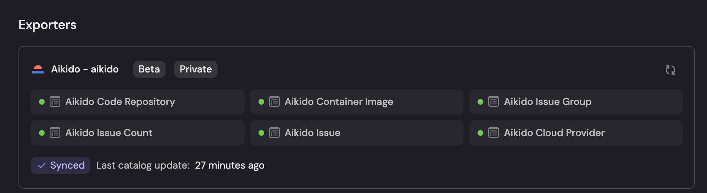

# Aikido Integration for Port Ocean

This integration syncs Aikido resources into [Port Ocean](https://www.getport.io/), enabling visibility and governance across your software catalog.

---

## 🚀 Getting Started

### ✅ Prerequisites

* Python `3.12.11` or later
* [Poetry](https://python-poetry.org/)
* [Port Ocean CLI](https://pypi.org/project/port-ocean/)
* [Helm](https://helm.sh/) (for local Kubernetes deployments)
* [Minikube](https://minikube.sigs.k8s.io/) (optional for local k8s)

---

### 🔧 Setup Instructions

1. **Clone the Repository**

   ```sh
   git clone <repo-url>
   cd aikido
   ```

2. **Configure Environment Variables**

   ```sh
   cp .env.example .env
   # Then edit .env and update credentials as needed
   ```

3. **Create and Activate Virtual Environment**

   ```sh
   python3 -m venv .venv
   source .venv/bin/activate
   ```

4. **Install Port Ocean CLI**

   ```sh
   pip install "port-ocean[cli]"
   ```

5. **Install Dependencies (including dev)**

   ```sh
   poetry install
   ```

6. **Run the Integration**

   ```sh
   make run
   ```

---

## 📦 Features

* Syncs various Aikido resources into Port Ocean:

  * Issues
  * Groups
  * Cloud Providers
  * Code Repositories
  * Container Images
  * And more
* Fully extendable and ready for production use.
* Designed for easy local and cloud deployment.

---

## 💪 Integration in Action

The integration syncs Aikido resources to Port Ocean and reflects them as green (healthy) exporters in the Port UI.



---

## 🧪 Local Deployment with Helm (Minikube)

Deploy Port Ocean locally using Helm and Minikube:

```sh
helm upgrade --install git-init port-labs/port-ocean \
  --set port.clientId=<PortClientId> \
  --set port.clientSecret=<PortClientSecret> \
  --set initializePortResources=true \
  --set integration.identifier=<Identifier> \
  --set integration.type="github" \
  --set integration.eventListener.type="POLLING" \
  --set integration.config.aikidoClientId=<aikidoClientId> \
  --set integration.config.aikidoClientSecret=<aikidoClientSecret>
```

> **Note:** Replace placeholder values (`<...>`) with your actual credentials.

---

## 🧰 Running Tests

Run all unit and integration tests with:

```sh
poetry run pytest
```

Useful options:

* Verbose mode: `pytest -v`
* Run matching pattern: `pytest -k <pattern>`

Tests are located in `aikido/tests/`, and new tests should follow the `test_*.py` naming convention.

---

## 📁 Project Structure

```
aikido/
├── auth/                # OAuth2 and token management
├── exporters/           # Exporters for each Aikido resource
├── http/                # HTTP client with retries
├── kind/                # Enum definitions for resource kinds
├── resync_handlers/     # Handlers for Port Ocean resync events
├── tests/               # Unit and integration tests
├── main.py              # Entrypoint: startup, loop, handler registration
.port/
├── resources/
│   ├── blueprints.json         # Blueprint schemas
│   └── port-app-config.yml     # Resource mapping config
├── spec.yaml                   # Integration metadata
Dockerfile                      # Container instructions
logging_config.py               # Centralized Loguru config
requirements.txt                # Python dependencies
README.md                       # Project documentation
```

---

## 📚 Resources

* [Port Integration Docs](https://docs.port.io/build-your-software-catalog/sync-data-to-catalog/)
* [Port Ocean SDK Docs](https://ocean.getport.io/develop-an-integration/)
* *(Replace with project-specific documentation if available)*

---

## 🤝 Contributing

Contributions are welcome!
Feel free to open issues, suggest improvements, or submit pull requests.

---

## 📧 Support

For questions or help, please:

* Open an issue in the repository
* Contact the maintainers directly
